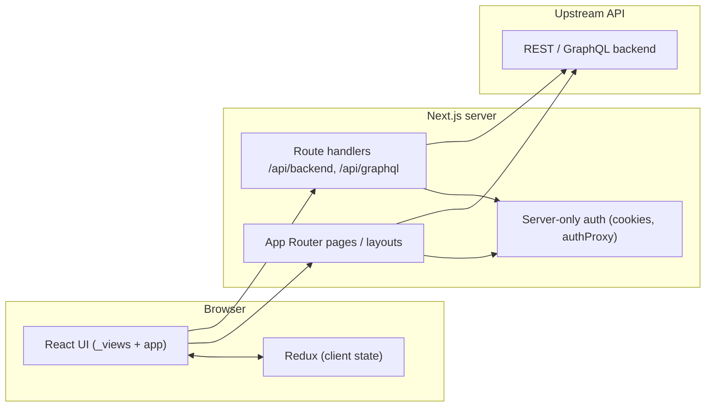

# Frontend engineering guide

**Product:** Big Chief Ent (hip-hop blog / content platform)  
**Audience:** Junior to mid-level engineers, reviewers, and operators  
**Scope:** The Next.js application under `frontend/app`  
**Last updated:** April 16, 2026  

---

## Table of contents

1. [Purpose of this document](#1-purpose-of-this-document)
2. [Executive summary](#2-executive-summary)
3. [Technology stack](#3-technology-stack)
4. [Where the code lives](#4-where-the-code-lives)
5. [Architecture overview](#5-architecture-overview)
6. [Rendering and routing (Next.js App Router)](#6-rendering-and-routing-nextjs-app-router)
7. [Source directory map (`src/`)](#7-source-directory-map-src)
8. [Networking and the BFF pattern](#8-networking-and-the-bff-pattern)
9. [Authentication and session](#9-authentication-and-session)
10. [Client state (Redux)](#10-client-state-redux)
11. [UI layer](#11-ui-layer)
12. [Security (frontend-relevant)](#12-security-frontend-relevant)
13. [Testing strategy](#13-testing-strategy)
14. [How to run tests and CI locally](#14-how-to-run-tests-and-ci-locally)
15. [Continuous integration (GitHub Actions)](#15-continuous-integration-github-actions)
16. [Enterprise quality assessment (by category)](#16-enterprise-quality-assessment-by-category)
17. [Release and operations checklist](#17-release-and-operations-checklist)
18. [Glossary](#18-glossary)

---

## 1. Purpose of this document

This guide explains **how the frontend is structured**, **how data and auth move through the app**, **how quality is enforced** (lint, types, tests, CI), and **how the codebase was assessed** against enterprise-style expectations.

It is **not** a substitute for reading code when debugging a specific bug, but it gives a **single narrative** from top to bottom so a new contributor knows where to look.

---

## 2. Executive summary

The frontend is a **Next.js 16** application using the **App Router**, **React 19**, and **TypeScript (strict)**. User-facing UI is built with **React Bootstrap** and related libraries. **Redux Toolkit** with **redux-persist** holds client-side user/session-related state. Server-side data fetching and auth-sensitive logic use **Next.js server components**, **server actions**, and **Route Handlers** under `src/app/api` that act as a **Backend-for-Frontend (BFF)** proxy to the real API.

**Quality gates** include ESLint (including accessibility rules), `tsc --noEmit`, a **Node smoke test** runner, **Vitest** unit tests with **coverage thresholds** on critical modules, and **Playwright** end-to-end tests. **GitHub Actions** runs the full pipeline on pushes and pull requests.

---

## 3. Technology stack

| Layer | Technology | Role |
|-------|------------|------|
| Framework | Next.js 16 (App Router) | Routing, SSR/SSG boundaries, API routes, images |
| UI library | React 19 | Components and hooks |
| Language | TypeScript (strict) | Type safety across the codebase |
| Styling / UI | Bootstrap 5, react-bootstrap, bootstrap-icons | Layout and components |
| Client state | Redux Toolkit, react-redux, redux-persist | Global state + persistence (e.g. user slice) |
| Data fetching | SWR, custom services | Articles and remote data |
| Validation | Zod | Form / payload validation in places |
| JWT / crypto | `jose` | Token handling where used on server |
| Local DB (client) | Dexie | IndexedDB usage where applicable |
| Animation | Framer Motion | Transitions |
| Carousels | Swiper | Home / article carousels |
| WebSocket | reconnecting-websocket | Live updates where configured |

**Dev / quality tooling:** ESLint (Next + TypeScript + jsx-a11y), Vitest, `@vitest/coverage-v8`, happy-dom, React Testing Library, Playwright.

---

## 4. Where the code lives

All application source for this product lives under **`frontend/app`**. This is the **npm package root** (`package.json`, `next.config`, etc.).

```
frontend/
├── doc/                          # This documentation (org-level)
└── app/                          # Next.js application
    ├── package.json
    ├── next.config.*             # Next.js configuration
    ├── tsconfig.json             # Path alias: @/* → src/*
    ├── eslint.config.mjs
    ├── vitest.config.ts          # Unit tests + coverage thresholds
    ├── playwright.config.ts      # E2E: base URL port 3002, webServer start
    ├── scripts/
    │   └── run-tests.mjs         # Node “smoke” tests (no Vitest)
    ├── e2e/                      # Playwright specs (*.spec.ts)
    ├── public/                   # Static assets
    └── src/
        ├── app/                  # App Router: layouts, pages, route handlers
        ├── _network/             # HTTP, GraphQL, WebSocket clients, endpoints
        ├── _services/           # Auth, articles, business calls
        ├── _views/               # Presentational / feature UI
        ├── _store/               # Redux store, slices, provider
        ├── _navigation/        # Nav shell, overlays, server nav helpers
        ├── _core/                # Shared layout, pagination utilities
        ├── _queries/             # Data/query helpers (e.g. GraphQL strings)
        ├── _utilities/           # Hooks, helpers, schemas
        └── _types/               # Shared TypeScript types
```

**Convention:** Folders prefixed with `_` are **internal application modules**, not route segments. Routes live under `src/app/...`.

---

## 5. Architecture overview

At a high level, traffic flows like this:



- **Browser** runs React, Redux, and calls **same-origin** API routes (`/api/...`) or server components fetch on the server.
- **Route handlers** proxy to the configured **API base URL** (environment-driven), attaching cookies/authorization as implemented in each handler.
- **Sensitive token refresh and cookie updates** are designed to run on the **server** where possible (`server-only` modules, `cookies()` from `next/headers`).

This is a **layered** architecture:

1. **Presentation:** `src/app` pages + `_views`
2. **Application / hooks:** `_utilities/hooks`, flows (e.g. signup, login)
3. **Domain services:** `_services` (auth, articles, etc.)
4. **Infrastructure:** `_network` (HTTP client, endpoints), API routes

---

## 6. Rendering and routing (Next.js App Router)

- **File-system routing:** Folders under `src/app` define URLs (e.g. `src/app/articles/[category]/page.tsx` → `/articles/:category`).
- **Layouts:** Nested layouts wrap child routes; root layout pulls in global CSS and shell components.
- **Parallel routes (example):** Auth uses segments such as `@login` and `@signup` with a shared `auth/layout.tsx` for shared chrome (tabs, logo).
- **Dynamic segments:** e.g. `[id]`, `[category]`, `[info]` for article details, categories, and information pages.
- **Route Handlers:** `src/app/api/backend/[...path]/route.ts` implements a **reverse proxy** to the backend REST API. **GraphQL** has a dedicated handler under `src/app/api/graphql/route.ts`.

New engineers should read **one full route** end-to-end: e.g. `src/app/page.tsx` → components in `_views` → `_services` / `_queries` as needed.

---

## 7. Source directory map (`src/`)

| Area | Path | Responsibility |
|------|------|----------------|
| Routes & API | `src/app/` | Pages, layouts, `route.ts` handlers, metadata |
| Network | `src/_network/` | `endpoints.ts` (URLs, env resolution), `HttpClient`, GraphQL/WebSocket clients |
| Services | `src/_services/` | Auth (login, signup, password reset, `authProxy`, `AuthGate`), articles, etc. |
| Views | `src/_views/` | Feature UI: home, articles, auth forms, details, account panels |
| State | `src/_store/` | `makeStore`, persisted reducer, user/app slices, provider |
| Navigation | `src/_navigation/` | Top bar, overlays, server components for shell; public API via `@/_navigation` |
| Core | `src/_core/` | Root layout pieces, pagination abstractions |
| Queries | `src/_queries/` | GraphQL documents / query builders |
| Utilities | `src/_utilities/` | Hooks, date picker, auth flows, Zod schemas |
| Types | `src/_types/` | Shared domain types (user, auth responses, etc.) |

**Path alias:** `@/` maps to `src/` (see `tsconfig.json`). Example: `import { X } from "@/_network/..."`.

**ESLint:** Imports from `@/_navigation/*` are restricted; the codebase expects navigation to be consumed through `@/_navigation` for consistency.

---

## 8. Networking and the BFF pattern

### Endpoints

`src/_network/config/endpoints.ts` centralizes:

- Default and environment-based **API base URL** (`NEXT_PUBLIC_API_URL`, `NEXT_PUBLIC_ARTICLEURL`, etc.).
- **Browser vs server** URL shapes (e.g. `/api/graphql` in the browser vs full upstream URL on the server).
- **Auth endpoint paths** (OTP, signup, refresh token, etc.).

### HTTP client

`HttpClient` (`src/_network/core/HttpClient.ts`) sends JSON by default but **detects `FormData`** and avoids forcing `Content-Type: application/json` so multipart uploads work.

### Backend proxy (`/api/backend/...`)

The route handler:

- Builds an **upstream URL** from the incoming path and query string.
- For mutating methods, reads the body as **raw bytes** (`arrayBuffer()`) so **multipart file uploads** are not corrupted by UTF-8 text decoding.
- Forwards **cookies** and **Authorization**, and can **refresh access tokens** when responses are `401`, depending on the implementation in the file.

### GraphQL proxy (`/api/graphql`)

Forwards POST bodies to the upstream GraphQL endpoint with selected headers. Behavior is intentionally slimmer than the REST proxy; teams should confirm it matches their **auth model** (header-only vs cookie).

---

## 9. Authentication and session

### Client-side gating

`AuthGate` (`src/_services/auth/authGate.tsx`) is a **client component** that:

- Reads **hydration** and **authentication** flags from Redux.
- Redirects **guest-only** routes (e.g. auth screens) if the user is already logged in, and **auth-only** experiences if not.

### Server-side auth

`authProxy` / related server-only code (`src/_services/auth/authproxy.ts` and similar) uses **`next/headers` cookies** to obtain refresh/access tokens, refresh when needed, and load the current user. Cookie options use **`getCookieSettings`** (httpOnly, secure in production, SameSite, path, maxAge).

### Client signup / login flows

Flows live under `_utilities/hooks/auth/...` and `_services/auth/...`, with validation helpers (e.g. **signup validation** extracted for testability). Multipart signup completion runs through services that call the **same-origin** API so cookies and headers stay consistent.

---

## 10. Client state (Redux)

- **Store:** `configureStore` + **persisted** root reducer (`redux-persist`), with **whitelist** typically including `user`.
- **Slices:** e.g. user slice for authentication display and `AuthGate` inputs.
- **Serialization:** Middleware ignores persist actions for serializable checks where configured.

Understanding **rehydration** is important: `AuthGate` waits for hydration before redirecting to avoid flashing wrong screens.

---

## 11. UI layer

- **React Bootstrap** provides layout primitives (Container, tabs, forms).
- **Views** under `_views` are organized by feature (Home, authorization, details, account).
- **Images:** Next.js `Image` is used where configured (e.g. auth layout logo).
- **Accessibility:** `eslint-plugin-jsx-a11y` helps catch common issues; it does not replace manual testing or audits.

---

## 12. Security (frontend-relevant)

**Strengths**

- BFF reduces direct exposure of upstream hosts; cookies and tokens are handled with server-aware patterns.
- **HttpOnly** cookies for session material where implemented; **Secure** in production via cookie settings.
- **Strict TypeScript** and linting reduce bug classes.

**Practices to maintain**

- Avoid **logging secrets or tokens** (remove stray `console.log` in auth flows before production).
- Keep **dependencies** updated and review `npm audit` (address per severity policy).
- Align **GraphQL vs REST** proxy behavior with security review (what is forwarded, when refresh runs).

This document does **not** constitute a penetration test or formal security audit.

---

## 13. Testing strategy

The project uses **three complementary layers**:

### 13.1 Smoke tests (Node, no bundler)

- **Script:** `frontend/app/scripts/run-tests.mjs`
- **Runner:** `node --experimental-strip-types` (loads TypeScript from `src/` with Node’s type stripping)
- **Focus:** Fast checks for **endpoint resolution**, **HttpClient** behavior with a mocked `fetch`, and **auth helper** functions (`getCookieSettings`, `extractUser`, `isAuthErrorUser`), plus **signup validation** imports used by the smoke runner.

**Command:** `npm run test:smoke`

### 13.2 Unit / integration tests (Vitest)

- **Config:** `frontend/app/vitest.config.ts`
- **Environment:** **happy-dom** (DOM-like environment without the heavier jsdom dependency issues on some setups)
- **Files:** `src/**/*.test.ts`, `src/**/*.test.tsx`
- **Coverage:** **v8** provider; **thresholds enforced** on a **defined allowlist** of production files:
  - `signupValidation.ts`
  - `auth.helpers.ts`
  - `HttpClient.ts`
  - `endpoints.ts`
- **Thresholds (current):** lines 85%, branches 78%, functions 85%, statements 85% (see `vitest.config.ts` for truth).

**Command:** `npm run test:unit`

### 13.3 End-to-end tests (Playwright)

- **Directory:** `frontend/app/e2e/`
- **Config:** `playwright.config.ts` — base URL **`http://127.0.0.1:3002`**, **`next start`** as `webServer` so tests hit a **production build** locally.
- **CI:** `CI=true` disables reusing an existing server so runs are deterministic.

**Command:** `npm run test:e2e` (requires **build** first unless a server is already running on 3002 in non-CI mode)

**Specs (examples):**

- Home page loads and title matches branding.
- Auth route loads and shows Login/Signup tabs.
- An articles category route responds successfully.

### 13.4 Combined test entrypoint

`npm run test` runs **smoke** then **Vitest** (`test:smoke && test:unit`).

---

## 14. How to run tests and CI locally

All commands assume **`cd frontend/app`** and **`npm install`** completed.

| Goal | Command |
|------|---------|
| Development server | `npm run dev` |
| Lint only | `npm run lint` |
| Typecheck only | `npm run typecheck` |
| Smoke tests only | `npm run test:smoke` |
| Vitest + coverage | `npm run test:unit` |
| All unit-level tests (smoke + Vitest) | `npm run test` |
| Production build | `npm run build` |
| E2E (starts server on 3002 per config) | `npm run test:e2e` |
| Lint + types + all unit-level tests | `npm run validate` |
| **Full CI equivalent** | `npm run ci` → validate + build + E2E |

**Typical pre-push sequence:**

```bash
npm run ci
```

If E2E fails locally, ensure port **3002** is free or rely on **`CI=true`** for a clean Playwright run.

---

## 15. Continuous integration (GitHub Actions)

Workflow: **`.github/workflows/frontend-ci.yml`**

On **push** (branches `main` / `master`) and **pull_request**:

1. Checkout  
2. **Node 22** + npm cache (`frontend/app/package-lock.json`)  
3. `npm ci`  
4. `npm run lint`  
5. `npm run typecheck`  
6. `npm run test` (smoke + Vitest coverage)  
7. `npm run build`  
8. Install Playwright Chromium + system deps  
9. `npm run test:e2e` with **`CI: true`**

This is the **authoritative** definition of “green” for the frontend in this repository.

---

## 16. Enterprise quality assessment (by category)

This section translates an **internal engineering review** into **clear expectations** for junior and mid-level developers. Grades are **relative to a small-to-mid product team**, not a hypothetical FAANG platform. **“A”** means “strong for the context”; **“C”** means “works, but invest before scaling or compliance-heavy industries.”

### 16.1 Overall

| Grade | **A** |
|-------|--------|
| **Summary** | The frontend is **production-capable and strong** with stable architecture, CI quality gates, and hardened auth/session behavior. To push toward **A+**, continue deepening automated journey coverage and observability sink integrations. |

### 16.2 Security — **A-**

| Strength | Detail |
|----------|--------|
| BFF / proxy | API routes hide upstream configuration; multipart proxy uses binary-safe body handling. |
| Cookies | Server paths use httpOnly, production `secure`, SameSite via shared helpers. |
| Type safety | Strict TypeScript + lint reduce entire bug classes. |
| Proxy parity | GraphQL and REST proxy handlers both support cookie/header auth forwarding plus 401 refresh+retry flow. |
| Response hardening | Security headers are applied on proxy responses and globally (`X-Content-Type-Options`, `X-Frame-Options`, `Referrer-Policy`, `Permissions-Policy`). |

| Gap | What to do |
|-----|------------|
| CSP hardening | Move from baseline headers to route-aware Content-Security-Policy once third-party/script inventory is finalized. |
| Security telemetry | Add centralized client/server security event reporting to improve incident response speed. |
| Ongoing review | Keep GraphQL and REST proxy forwarding rules reviewed whenever auth/session logic changes. |

### 16.3 Architecture — **A**

| Strength | Detail |
|----------|--------|
| Layering | Clear split: `app`, `_views`, `_services`, `_network`, `_store`. |
| Next.js patterns | App Router, layouts, route handlers used intentionally. |
| Pagination / core | Shared `_core/pagination` patterns improve consistency. |
| Import boundaries | ESLint boundaries rules now enforce critical layer constraints (network/store isolated from route/view layer). |
| Global request policy | `src/proxy.ts` now documents and enforces a clear minimal policy (no auth redirects there, request correlation ID propagation). |

| Gap | What to do |
|-----|------------|
| Boundary depth | Expand boundaries rules over time from critical constraints to fuller directional architecture map as modules stabilize. |
| Runtime policy docs | Keep proxy/layout/API policy docs synchronized as auth/security responsibilities evolve. |

### 16.4 Testing — **B+**

| Strength | Detail |
|----------|--------|
| CI coverage | Lint, typecheck, smoke, Vitest with **enforced thresholds** on critical files, Playwright E2E. |
| Risk alignment | Tests target **networking, auth helpers, signup validation**—high-impact areas. |

| Gap | What to do |
|-----|------------|
| UI / hook coverage | Most screens and hooks are not yet covered by RTL/Vitest; add tests for **highest-risk flows** first. |
| E2E breadth | Expand Playwright for critical journeys (login/signup) when environments allow. |

### 16.5 Reusability — **B**

Hooks and pagination adapters promote reuse. Auth flows can still **drift**; prefer shared error mapping and small shared primitives as features grow.

### 16.6 Maintainability — **B**

Strict lint and TypeScript help. **Console noise** and occasional **naming inconsistencies** (e.g. legacy folder names) add onboarding cost. Align **eslint-config-next** major with **Next** over time.

### 16.7 Observability — **B+**

| Observation | Detail |
|-------------|--------|
| Current state | Baseline observability is now in place: global + route error boundaries, structured application logging primitives, request correlation IDs on proxy responses, and Web Vitals reporting hooks. |
| Enterprise expectation | Keep this baseline and add sink integrations (APM/RUM, alerting, and long-term dashboards) so client + server error/event signals are queryable and actionable at scale. |

### 16.8 Accessibility — **B**

`jsx-a11y` ESLint rules provide a **baseline**. WCAG compliance for a public site still needs **manual checks** and possibly automated axe audits in CI.

### 16.9 DevOps / CI — **A−**

GitHub Actions workflow is **clear, ordered, and reproducible** (Node version, `npm ci`, full pipeline including Playwright).

### 16.10 Dependencies / supply chain — **B−**

Lockfile + CI are good. Track **`npm audit`** according to policy; use **Dependabot** (present at repo level) with review rules.

---

## 17. Release and operations checklist

Before tagging a release or merging to production:

1. Run **`npm run ci`** in `frontend/app`.  
2. Confirm **environment variables** for production (`NEXT_PUBLIC_*`, API URLs) in hosting docs.  
3. Remove or **feature-flag** debug logging in sensitive paths.  
4. Smoke-test **auth** and **primary content** paths manually after deploy.  
5. Plan **error reporting** (even a minimal integration) if not yet deployed.

---

## 18. Glossary

| Term | Meaning |
|------|---------|
| **App Router** | Next.js file-based router under `app/` with layouts, nested routes, and React Server Components boundaries. |
| **BFF** | Backend-for-Frontend: Next.js API routes that proxy or adapt backend services for the browser. |
| **Smoke test** | Fast, minimal suite that catches obvious breakage (here: Node script + critical imports). |
| **Vitest** | Fast unit test runner used with TypeScript and coverage. |
| **Playwright** | Browser automation for end-to-end tests. |
| **Coverage threshold** | CI fails if metrics fall below configured percentages for included files. |
| **Hydration** | Client attaching to server-rendered HTML; Redux persist must complete before some UI decisions. |
| **httpOnly cookie** | Cookie not readable from JavaScript—mitigates some XSS token theft scenarios. |

---

## Document history

| Version | Date | Notes |
|---------|------|-------|
| 1.0 | 2026-04 | Initial enterprise-style guide: stack, structure, testing, CI, quality assessment. |
| 1.1 | 2026-04-16 | Security hardening update: auth log cleanup, proxy parity improvements, baseline security headers, revised security grade. |
| 1.2 | 2026-04-16 | Observability baseline update: error boundaries, Web Vitals reporter, request correlation IDs, structured logger guidance. |
